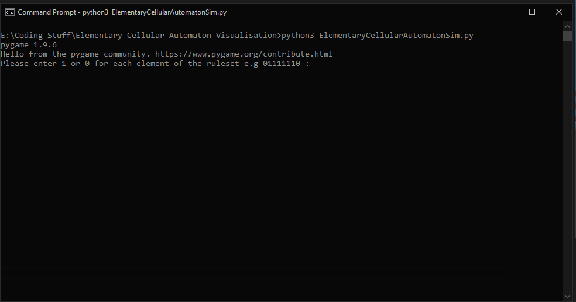
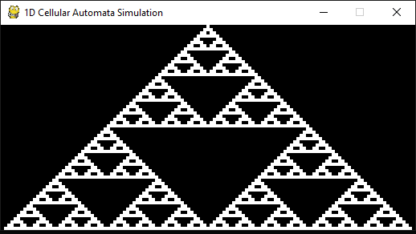

# Elementary-Cellular-Automaton-Visualisation

A small Python3 program that visualises [Elementary Cellular Automaton](http://mathworld.wolfram.com/ElementaryCellularAutomaton.html)

## Dependencies

[Python3](https://www.python.org/downloads/) 
[Pygame](https://www.pygame.org/) 

### Note

Please ensure you are using python3 as this program will not run using python2.

## Deployment

After cloning the repo navigate into the directory `cd Elementary-Cellular-Automaton-Visualisation`.

The run the command `python Elementary-Cellular-Automaton-Visualisation.py`

You will be then greeted with a command line interface to setup the visualisation.

 

The program will ask for the ruleset that is to be used when creating the next generation of cells. A ruleset is an 8-bit binary value e.g. 01111110.

After this a pygame window will open displaying the simulated Automaton. 

 

To exit the program simply press escape key when the simulation is complete.

## Modifications to program

By default the program will calculate 64 generations but this can be changed by altering the `GENERATIONCOUNT` variable.

If the pygame window is too big or too small it can be scaled by changing the `RESOLUTIONSCALE` variable.
